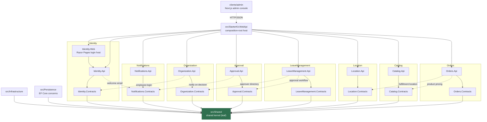
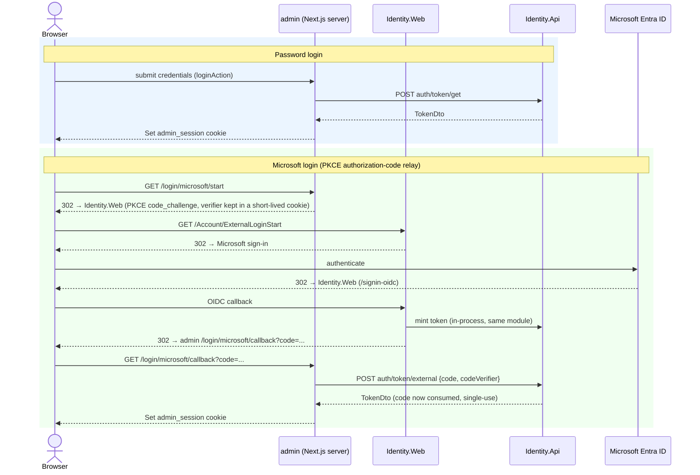

# StarterKit — Modular Monolith Solution Template for ASP.NET Core

A starter template monorepo for a full-stack application: a C#/.NET backend organized as a **Modular Monolith** (built on the private "Light" framework family — `Lightsoft.*` packages), plus one or more frontend clients. Meant to be cloned/forked as the starting point for new projects.

## Status — what's actually built so far

Backend has a working host with **eight business modules**; the `admin` client is a real, functioning app (not a UI shell) with no mock data remaining.

| Piece | Status |
|---|---|
| `src/Shared`, `src/Infrastructure`, `src/Persistence` (shared kernel + EF Core concerns) | ✅ built |
| `src/Identity.Api` + `src/Identity.Contracts` — users, roles, claims, JWT auth/token issuance, permission catalog | ✅ built, tested (`tests/Identity.Tests`, ~100 tests) |
| `src/Identity.Web` — Razor Pages login host: interactive cookie login, Microsoft Entra ID (OIDC) external login, and a PKCE authorization-code relay letting a separate-origin client (e.g. `admin`) complete Microsoft sign-in — co-hosted in `StarterKit.WebApi`, or standalone as a login-only process | ✅ built |
| `src/Notifications.Api` + `src/Notifications.Contracts` — notification storage + real-time SignalR push (admin + self-service surfaces) | ✅ built — no dedicated test project yet |
| `src/Organization.Api` + `src/Organization.Contracts` — companies, department/team hierarchy (`OrgUnit`), employee levels, employees, optional employee↔Identity-login linking; exposes `IOrgDirectoryService` | ✅ built, tested (`tests/Organization.Tests`, ~63 tests) |
| `src/Approval.Api` + `src/Approval.Contracts` — generic multi-level approval-request engine driven via `IApprovalService`; not tied to any request type | ✅ built, tested (`tests/Approval.Tests`, ~57 tests) |
| `src/LeaveManagement.Api` + `src/LeaveManagement.Contracts` — self-service leave requests; delegates the approval workflow to Approval, resolves approvers via Organization | ✅ built, tested (`tests/LeaveManagement.Tests`, ~30 tests) |
| `src/Location.Api` + `src/Location.Contracts` — self-referencing physical-location hierarchy (`Location`) plus a data-driven `LocationType` catalog with configurable allowed-parent/child rules; exposes `ILocationDirectoryService` | ✅ built, tested (`tests/Location.Tests`, ~114 tests) |
| `src/Catalog.Api` + `src/Catalog.Contracts` — self-referencing product-category tree (`Category`) plus `Product` CRUD/search/activate-deactivate/image management; exposes `ICatalogPricingService` | ✅ built, tested (`tests/Catalog.Tests`, ~111 tests) |
| `src/Orders.Api` + `src/Orders.Contracts` — sale lifecycle (draft → placement → payment reconciliation → fulfillment/cancellation) via the `Order` and `Payment` aggregates; consumes Catalog's `ICatalogPricingService` and Location's `ILocationDirectoryService` | ✅ built, tested (`tests/Orders.Tests`, ~121 tests) |
| `src/Migrations/{MSSQL,PostgreSQL,Sqlite}` (design-time EF Core migration projects) | ✅ built — MSSQL covers all eight modules; PostgreSQL/Sqlite cover only Identity/Organization/Approval/LeaveManagement (missing Notifications, Location, Catalog, Orders) |
| `src/StarterKit.WebApi` (composition-root host) | ✅ built — runnable API |
| `tests/Framework.Tests` (xUnit v3, shared kernel/infra/persistence) | ✅ built — ~69 tests |
| `clients/admin` (Next.js admin console) | ✅ built — real auth (password or Microsoft); full CRUD for Users/Roles, Organization (companies/departments/employees), Retail administration (Locations, Catalog categories/products), Orders (two-phase draft-then-build order creation), a generic Approvals workflow, and self-service Leave requests; real-time Notifications; permission-gated nav |
| Additional `clients/*` apps (e.g. a primary end-user app) | ❌ not yet created |

## Structure

Projects that exist today, and how they depend on each other:

```text
StarterKit.slnx
├── src/Shared                     (leaf project — no dependencies)
├── src/Infrastructure             → Shared
├── src/Persistence                → Shared
├── src/Identity.Contracts         → Shared
├── src/Identity.Api               → Identity.Contracts, Infrastructure, Persistence, Notifications.Contracts
├── src/Identity.Web               → Identity.Api, Infrastructure (Razor Pages login host — co-hosted or standalone)
├── src/Notifications.Contracts    → Shared
├── src/Notifications.Api          → Notifications.Contracts, Infrastructure, Persistence
├── src/Organization.Contracts     → Shared
├── src/Organization.Api           → Organization.Contracts, Infrastructure, Persistence, Identity.Contracts
├── src/Approval.Contracts         → Shared
├── src/Approval.Api               → Approval.Contracts, Infrastructure, Persistence, Notifications.Contracts
├── src/LeaveManagement.Contracts  → Shared
├── src/LeaveManagement.Api        → LeaveManagement.Contracts, Infrastructure, Persistence, Approval.Contracts, Organization.Contracts
├── src/Location.Contracts         → Shared
├── src/Location.Api               → Location.Contracts, Infrastructure, Persistence
├── src/Catalog.Contracts          → Shared
├── src/Catalog.Api                → Catalog.Contracts, Infrastructure, Persistence
├── src/Orders.Contracts           → Shared, Catalog.Contracts, Location.Contracts
├── src/Orders.Api                 → Orders.Contracts, Infrastructure, Persistence, Catalog.Contracts, Location.Contracts
├── src/Migrations/MSSQL           → all eight *.Api projects, Infrastructure, Persistence, Shared
├── src/Migrations/PostgreSQL      → Identity/Organization/Approval/LeaveManagement *.Api, Infrastructure, Persistence, Shared
├── src/Migrations/Sqlite          → Identity/Organization/Approval/LeaveManagement *.Api, Infrastructure, Persistence, Shared
├── src/StarterKit.WebApi          → all eight *.Api projects, Identity.Web, Infrastructure, Shared (composition-root host)
├── tests/Framework.Tests          → Shared, Infrastructure, Persistence
├── tests/Identity.Tests           → Identity.Api, Shared
├── tests/Organization.Tests       → Organization.Api, Identity.Contracts, Shared
├── tests/Approval.Tests           → Approval.Api, Approval.Contracts, Shared
├── tests/LeaveManagement.Tests    → LeaveManagement.Api, Approval.Contracts, Organization.Contracts, Shared
├── tests/Location.Tests           → Location.Api, Shared
├── tests/Catalog.Tests            → Catalog.Api, Shared
├── tests/Orders.Tests             → Orders.Api, Orders.Contracts, Shared
└── clients/admin                  (Next.js app — HTTP/JSON only, no shared source with src/)
```

Every module reaches another module only through its `<Module>.Contracts` seam — never its `.Api` internals. The seven cross-module edges: `Identity → Notifications.Contracts` (welcome email), `Organization → Identity.Contracts` (employee-login), `Approval → Notifications.Contracts` (notify on decision), `LeaveManagement → Approval.Contracts` (approval workflow), `LeaveManagement → Organization.Contracts` (approver directory), `Orders → Catalog.Contracts` (product pricing via `ICatalogPricingService`), and `Orders → Location.Contracts` (fulfillment location via `ILocationDirectoryService`). `Identity.Web → Identity.Api` is an intra-module reference (same bounded context), not a cross-module edge.

## Architecture Diagram



Each `*.Api` project also depends on `Infrastructure` and `Persistence` (edges omitted above for readability).

## Login Flow (client ↔ server)

`admin` supports two sign-in paths that converge on the same session cookie. See
[docs/integration.md](docs/integration.md) and
[src/docs/architecture/modules/Identity.md § External Login (OIDC)](src/docs/architecture/modules/Identity.md)
for the full mechanics — this is the shape, not the detail.



## Tech Stack

| Layer | Stack |
|---|---|
| Backend runtime | ASP.NET Core (C#), `net10.0` |
| Backend architecture | Modular Monolith — flat projects under `src/`: eight modules (`Identity`, `Notifications`, `Organization`, `Approval`, `LeaveManagement`, `Location`, `Catalog`, `Orders`), each an `<Module>.Api` + `<Module>.Contracts` pair (Identity also ships `Identity.Web`, a Razor Pages login host), plus the shared kernel (`Shared`, `Infrastructure`, `Persistence`) and the `StarterKit.WebApi` composition-root host. One `DbContext` per module, all sharing one physical database separated by schema |
| Backend data access | EF Core — provider-configurable via `DbProvider` in `appsettings.json` (`InMemory` / `PostgreSQL` / `MSSQL` / `Sqlite`), with a design-time migrations project per relational provider (`src/Migrations/{MSSQL,PostgreSQL,Sqlite}`) |
| Vendor framework | `Lightsoft.*` package family (mediator, `Result`/`Paged` contracts, domain base types, ASP.NET Core authorization/modularity/CORS helpers, caching (`Lightsoft.Caching`, config-driven in-memory/Redis switch), Serilog) |
| Testing | xUnit v3 on Microsoft.Testing.Platform — `tests/{Framework,Identity,Organization,Approval,LeaveManagement,Location,Catalog,Orders}.Tests` (~69 / ~100 / ~63 / ~57 / ~30 / ~114 / ~111 / ~121 tests respectively). No dedicated test project for Notifications yet; no mocking library beyond `Moq` for cross-module seam interfaces — otherwise hand-written fakes / real in-memory DbContexts |
| Clients | `clients/admin/` — Next.js 16 (App Router), React 19, TypeScript, Tailwind CSS v4, pnpm. Real auth (encrypted-cookie sessions, password or Microsoft, proactive token refresh), CRUD for Identity / Organization / Location / Catalog / Orders / Approvals / Leave requests against the eight backend modules, real-time Notifications via SignalR (browser connects directly to the backend). No mock data. Currently the only client app |

## Getting Started

### Backend

```bash
dotnet build StarterKit.slnx
dotnet test tests/Framework.Tests/Framework.Tests.csproj      # repeat per tests/*.Tests project
dotnet run --project src/StarterKit.WebApi/StarterKit.WebApi.csproj
```

Configure the DB provider and connection string in `src/StarterKit.WebApi/appsettings.json` (`DbProvider`: `InMemory` | `PostgreSQL` | `MSSQL` | `Sqlite`). On the .NET 10 SDK, if `dotnet test` refuses the legacy VSTest path, run the built test executable directly — see [src/CLAUDE.md § Testing](src/CLAUDE.md).

### Client (`clients/admin`)

```bash
cd clients/admin
pnpm install
cp .env.example .env.local   # set the eight *_API_BASE_URL vars, IDENTITY_WEB_BASE_URL, TOKEN_ENCRYPTION_KEY, SIGNALR_HUB_URL
pnpm dev
```

All env vars are server-only (never `NEXT_PUBLIC_`). The backend must be running and reachable at the `*_API_BASE_URL` values for auth/data pages to work, and its CORS policy must allow the admin app's origin for the SignalR notification hub (`SIGNALR_HUB_URL`) to connect directly from the browser.

## Documentation

- [CLAUDE.md](CLAUDE.md) — repository-wide entry point (structure, AI operating rules, where things live).
- [docs/integration.md](docs/integration.md) — cross-cutting backend ↔ clients integration contract.
- [src/CLAUDE.md](src/CLAUDE.md) / [src/docs/](src/docs/) — backend module inventory, architecture, conventions, known debt.
- [clients/admin/CLAUDE.md](clients/admin/CLAUDE.md) / [clients/admin/docs/](clients/admin/docs/) — admin client architecture, conventions.
- [.claude/](.claude/) — reusable Claude development infrastructure (agents, skills, workflows, commands), not project-specific documentation.

## License

MIT — see [LICENSE](LICENSE).
