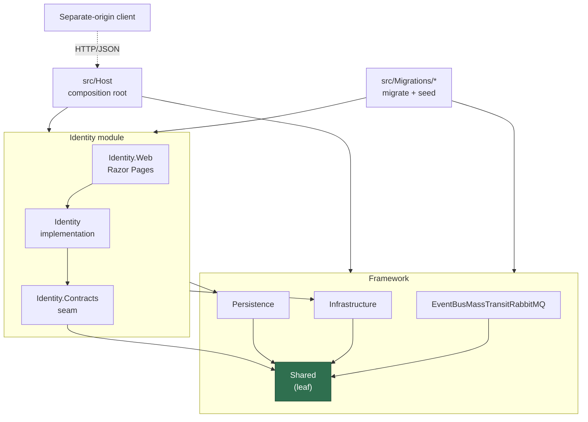

# StarterKit — Modular Monolith Core for ASP.NET Core

The core of the StarterKit Modular Monolith template: the reusable C#/.NET framework building blocks (built on the private "Light" framework family — `Lightsoft.*` packages), a composition-root host, and the Identity reference module, with their tests. Client apps are not part of this solution.

## Structure

Projects, grouped by solution folder in `StarterKit.slnx`:

```text
StarterKit.slnx
├── /src/_framework/
│   ├── src/Shared                          (shared kernel)
│   ├── src/Infrastructure                  (ASP.NET Core hosting building blocks)
│   ├── src/Persistence                     (EF Core building blocks)
│   └── src/EventBusMassTransitRabbitMQ     (integration-event bus)
├── /src/_host/
│   └── src/Host                            (StarterKit.Host — composition root, the only deployable)
├── /src/identity-module/
│   ├── src/Identity.Contracts              (the module's cross-module seam)
│   ├── src/Identity                        (module implementation — JSON API, token issuance, persistence)
│   └── src/Identity.Web                    (Razor Pages login and Microsoft login relay — co-hosted or standalone)
├── /src/_migrations/
│   ├── src/Migrations/MSSQL                (EF migrations + migrate-and-seed console app, SQL Server)
│   ├── src/Migrations/PostgreSQL           (same, PostgreSQL)
│   └── src/Migrations/Sqlite               (same, Sqlite)
└── /tests/
    ├── tests/Framework.Tests               (framework projects)
    └── tests/Identity.Tests                (Identity module)
```

Project responsibilities and the dependency rules are in [CLAUDE.md](CLAUDE.md#1-repository-purpose); the exact project references are in [docs/architecture/dependency-graph.md](docs/architecture/dependency-graph.md).

## Architecture Diagram


```mermaid
graph TD
    Client["Separate-origin client"]
    Host["src/Host<br/>composition root"]
    Migrators["src/Migrations/*<br/>migrate + seed"]

    subgraph IdentityModule["Identity module"]
        IdW["Identity.Web<br/>Razor Pages"]
        Id["Identity<br/>implementation"]
        IdC["Identity.Contracts<br/>seam"]
    end

    subgraph Framework["Framework"]
        Infra["Infrastructure"]
        Persistence["Persistence"]
        Bus["EventBusMassTransitRabbitMQ"]
        Shared["Shared<br/>(leaf)"]
    end

    Client -. HTTP/JSON .-> Host
    Host --> IdentityModule
    Host --> Framework
    Migrators --> IdentityModule
    Migrators --> Framework
    IdW --> Id
    Id --> IdC
    IdentityModule --> Infra & Persistence
    IdC --> Shared
    Infra & Persistence & Bus --> Shared

    classDef leaf fill:#2f6f4f,stroke:#1e4a34,color:#fff;
    class Shared leaf;
```

## Login Flow (client ↔ server)

A separate-origin client has two sign-in paths that both end with the client holding the same token pair (access + refresh token). See [Identity](docs/architecture/Identity.md) for the module's mechanics — this is the shape, not the detail.

```mermaid
sequenceDiagram
    actor U as Browser
    participant C as Client
    participant W as Identity.Web (in Host)
    participant I as Identity module (in Host)
    participant M as Microsoft Entra ID

    rect rgb(235, 245, 255)
    note over U,I: Password login
    U->>C: submit credentials
    C->>I: POST api/v1/auth/token/get
    I-->>C: TokenDto
    C-->>U: client stores the token pair
    end

    rect rgb(240, 255, 240)
    note over U,M: Microsoft login (PKCE authorization-code relay)
    U->>C: start Microsoft sign-in
    C-->>U: 302 → Identity.Web (state, PKCE code_challenge; client keeps the verifier)
    U->>W: GET /Account/ExternalLoginStart
    W-->>U: 302 → Microsoft sign-in
    U->>M: authenticate
    M-->>U: 302 → Identity.Web (/signin-oidc)
    U->>W: OIDC callback (/Account/ExternalLoginRelay)
    W->>I: resolve user, mint token (in-process, same module)
    W-->>U: 302 → client redirectUri?code=...&state=...
    U->>C: GET redirectUri?code=...
    C->>I: POST api/v1/auth/token/external {code, codeVerifier}
    I-->>C: TokenDto (code now consumed, single-use)
    C-->>U: client stores the token pair
    end
```

Access tokens are renewed through `POST api/v1/auth/token/refresh`. The client's `redirectUri` must be allow-listed in `ExternalLoginRelay:AllowedRedirectUris`.

## Tech Stack

| Layer | Stack |
|---|---|
| Runtime | ASP.NET Core (C#), `net10.0` |
| Architecture | Modular Monolith — see [Structure](#structure) |
| Data access | EF Core — provider-configurable via `DbProvider` (`InMemory` / `PostgreSQL` / `MSSQL` / `Sqlite`) |
| Authentication | ASP.NET Core Identity; self-issued JWT (Bearer) for the API; cookie for the Razor Pages; optional Microsoft Entra ID (OIDC) external login |
| Messaging | MassTransit over RabbitMQ for integration events; a no-op bus when disabled |
| Vendor framework | `Lightsoft.*` package family (mediator, `Result`/`Paged` contracts, domain base types, ASP.NET Core authorization/modularity helpers, caching, Serilog, event bus, Active Directory) |
| Validation / mapping | FluentValidation, Mapster |
| Testing | xUnit v3 + Moq on Microsoft.Testing.Platform (via `tests/ModuleTests.props`) |

Package versions are managed centrally in [Directory.Packages.props](Directory.Packages.props).

## Getting Started

```bash
dotnet build StarterKit.slnx
dotnet run --project src/Host/Host.csproj
```

`dotnet test` fails on the .NET 10 SDK; after building, run each test project's executable directly:

```bash
tests/Framework.Tests/bin/Debug/net10.0/Framework.Tests.exe
tests/Identity.Tests/bin/Debug/net10.0/Identity.Tests.exe
```

Database provider and schema setup, configuration, test filters, and migrations: [docs/conventions/development-guide.md](docs/conventions/development-guide.md).

## Documentation

- [CLAUDE.md](CLAUDE.md) — repository-wide entry point (project map, dependency direction, framework conventions, AI operating rules).
- [docs/](docs/) — generated project documentation; start at [docs/architecture/architecture.md](docs/architecture/architecture.md) (layering, runtime flows, and links to each project's overview).
- [docs/conventions/](docs/conventions/) — coding conventions, development guide, migrations, and local Docker infrastructure.
- [.claude/](.claude/) — reusable Claude development infrastructure (agents, skills, workflows), not project documentation.

## License

MIT — see [LICENSE](LICENSE).

---
_Last synced: 2026-09-30_
