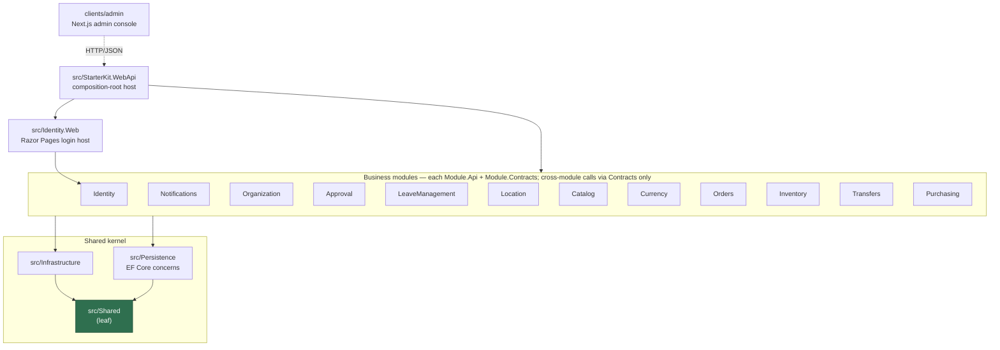
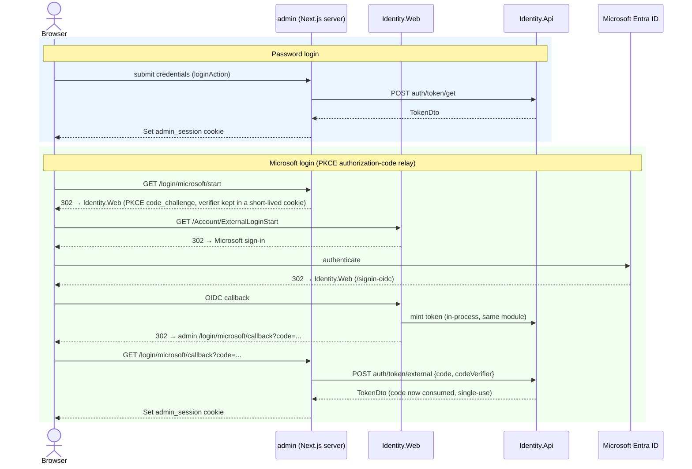

# StarterKit — Modular Monolith Solution Template for ASP.NET Core

A starter template monorepo for a full-stack application: a C#/.NET backend organized as a **Modular Monolith** (built on the private "Light" framework family — `Lightsoft.*` packages), plus one or more frontend clients. Meant to be cloned/forked as the starting point for new projects.

## Status — what's actually built so far

Backend has a working host with **twelve business modules**; the `admin` client is a real, functioning app (not a UI shell) with no mock data remaining.

| Piece | Status |
|---|---|
| `src/Shared`, `src/Infrastructure`, `src/Persistence` (shared kernel + EF Core concerns) | ✅ built |
| `src/Identity.Api` + `src/Identity.Contracts` — users, roles, claims, JWT auth/token issuance, permission catalog | ✅ built, tested |
| `src/Identity.Web` — Razor Pages login host: interactive cookie login, Microsoft Entra ID (OIDC) external login, and a PKCE authorization-code relay letting a separate-origin client (e.g. `admin`) complete Microsoft sign-in — co-hosted in `StarterKit.WebApi`, or standalone as a login-only process | ✅ built |
| `src/Notifications.Api` + `src/Notifications.Contracts` — notification storage + real-time SignalR push | ✅ built |
| `src/Organization.Api` + `src/Organization.Contracts` — companies, department/team hierarchy, employee levels, employees, optional employee↔Identity-login linking | ✅ built, tested |
| `src/Approval.Api` + `src/Approval.Contracts` — generic multi-level approval-request engine, not tied to any request type | ✅ built, tested |
| `src/LeaveManagement.Api` + `src/LeaveManagement.Contracts` — self-service leave requests, approved through Approval | ✅ built, tested |
| `src/Location.Api` + `src/Location.Contracts` — physical-location hierarchy with a data-driven location-type catalog | ✅ built, tested |
| `src/Catalog.Api` + `src/Catalog.Contracts` — product-category tree and products | ✅ built, tested |
| `src/Currency.Api` + `src/Currency.Contracts` — currency catalog (one base currency) and exchange-rate history | ✅ built, tested |
| `src/Orders.Api` + `src/Orders.Contracts` — sale lifecycle (draft → placement → payment reconciliation → fulfillment/cancellation) | ✅ built, tested |
| `src/Inventory.Api` + `src/Inventory.Contracts` — on-hand stock and moving-average valuation per product per location, strict no-oversell | ✅ built, tested |
| `src/Transfers.Api` + `src/Transfers.Contracts` — stock transfers between locations with an in-transit phase | ✅ built, tested |
| `src/Purchasing.Api` + `src/Purchasing.Contracts` — suppliers, purchase orders (approved through Approval), goods receipts, purchase returns | ✅ built, tested |
| `src/Migrations/{MSSQL,PostgreSQL,Sqlite}` (design-time EF Core migration projects) | ✅ built — MSSQL covers all twelve modules; PostgreSQL/Sqlite cover eleven (all but Notifications) — see [src/docs/conventions/migrations.md](src/docs/conventions/migrations.md) |
| `src/StarterKit.WebApi` (composition-root host) | ✅ built — runnable API |
| `tests/Framework.Tests` (xUnit v3, shared kernel/infra/persistence) | ✅ built |
| `clients/admin` (Next.js admin console) | ✅ built — real auth (password or Microsoft), permission-gated admin and self-service screens over the backend modules, real-time Notifications — see [clients/admin/CLAUDE.md](clients/admin/CLAUDE.md) |
| Additional `clients/*` apps (e.g. a primary end-user app) | ❌ not yet created |

Open gaps (including test coverage) are tracked in [src/docs/known-debt.md](src/docs/known-debt.md).

## Structure

Projects that exist today:

```text
StarterKit.slnx
├── src/Shared                          (shared kernel — leaf, no dependencies)
├── src/Infrastructure                  → Shared
├── src/Persistence                     → Shared
├── src/<Module>.Contracts              → Shared (the module's public seam)
├── src/<Module>.Api                    → own Contracts, Infrastructure, Persistence, other modules' Contracts only
│     <Module> = Identity, Notifications, Organization, Approval, LeaveManagement, Location,
│                Catalog, Currency, Orders, Inventory, Transfers, Purchasing
├── src/Identity.Web                    → Identity.Api, Infrastructure (Razor Pages login host — co-hosted or standalone)
├── src/Migrations/{MSSQL,PostgreSQL,Sqlite}  → migrated modules' *.Api, Infrastructure, Persistence, Shared
├── src/StarterKit.WebApi               → all twelve *.Api projects, Identity.Web, Infrastructure, Shared (composition-root host)
├── tests/Framework.Tests               → Shared, Infrastructure, Persistence
├── tests/<Module>.Tests                → that module's *.Api (+ the Contracts it mocks), Shared
└── clients/admin                       (Next.js app — HTTP/JSON only, no shared source with src/)
```

Every module reaches another module only through its `<Module>.Contracts` seam — never its `.Api` internals. `Identity.Web → Identity.Api` is an intra-module reference (same bounded context), not a cross-module edge. The exact project references and every cross-module edge are listed in [src/docs/architecture/dependency-graph.md](src/docs/architecture/dependency-graph.md).

## Architecture Diagram


```mermaid
graph TD
    Admin["clients/admin<br/>Next.js admin console"]
    Host["src/StarterKit.WebApi<br/>composition-root host"]
    IdW["src/Identity.Web<br/>Razor Pages login host"]

    subgraph Modules["Business modules — each Module.Api + Module.Contracts; cross-module calls via Contracts only"]
        direction LR
        Identity
        Notifications
        Organization
        Approval
        LeaveManagement
        Location
        Catalog
        Currency
        Orders
        Inventory
        Transfers
        Purchasing
    end

    subgraph Kernel["Shared kernel"]
        Infra["src/Infrastructure"]
        Persistence["src/Persistence<br/>EF Core concerns"]
        Shared["src/Shared<br/>(leaf)"]
    end

    Admin -. HTTP/JSON .-> Host
    Host --> Modules
    Host --> IdW
    IdW --> Identity
    Modules --> Infra & Persistence
    Infra --> Shared
    Persistence --> Shared

    classDef leaf fill:#2f6f4f,stroke:#1e4a34,color:#fff;
    class Shared leaf;
```

For the individual cross-module edges, see [src/docs/architecture/dependency-graph.md](src/docs/architecture/dependency-graph.md).

## Login Flow (client ↔ server)

`admin` supports two sign-in paths that converge on the same session cookie. See
[docs/integration.md](docs/integration.md) and
[src/docs/architecture/modules/Identity.md § External Login (OIDC)](src/docs/architecture/modules/Identity.md)
for the full mechanics — this is the shape, not the detail.


```mermaid
sequenceDiagram
    actor U as Browser
    participant A as admin (Next.js server)
    participant W as Identity.Web
    participant I as Identity.Api
    participant M as Microsoft Entra ID

    rect rgb(235, 245, 255)
    note over U,I: Password login
    U->>A: submit credentials (loginAction)
    A->>I: POST auth/token/get
    I-->>A: TokenDto
    A-->>U: Set admin_session cookie
    end

    rect rgb(240, 255, 240)
    note over U,M: Microsoft login (PKCE authorization-code relay)
    U->>A: GET /login/microsoft/start
    A-->>U: 302 → Identity.Web (PKCE code_challenge, verifier kept in a short-lived cookie)
    U->>W: GET /Account/ExternalLoginStart
    W-->>U: 302 → Microsoft sign-in
    U->>M: authenticate
    M-->>U: 302 → Identity.Web (/signin-oidc)
    U->>W: OIDC callback
    W->>I: mint token (in-process, same module)
    W-->>U: 302 → admin /login/microsoft/callback?code=...
    U->>A: GET /login/microsoft/callback?code=...
    A->>I: POST auth/token/external {code, codeVerifier}
    I-->>A: TokenDto (code now consumed, single-use)
    A-->>U: Set admin_session cookie
    end
```

## Tech Stack

| Layer | Stack |
|---|---|
| Backend runtime | ASP.NET Core (C#), `net10.0` |
| Backend architecture | Modular Monolith — flat projects under `src/`: twelve modules (`Identity`, `Notifications`, `Organization`, `Approval`, `LeaveManagement`, `Location`, `Catalog`, `Currency`, `Orders`, `Inventory`, `Transfers`, `Purchasing`), each an `<Module>.Api` + `<Module>.Contracts` pair (Identity also ships `Identity.Web`, a Razor Pages login host), plus the shared kernel (`Shared`, `Infrastructure`, `Persistence`) and the `StarterKit.WebApi` composition-root host. One `DbContext` per module, all sharing one physical database separated by schema |
| Backend data access | EF Core — provider-configurable via `DbProvider` in `appsettings.json` (`InMemory` / `PostgreSQL` / `MSSQL` / `Sqlite`), with a design-time migrations project per relational provider (`src/Migrations/{MSSQL,PostgreSQL,Sqlite}`) |
| Vendor framework | `Lightsoft.*` package family (mediator, `Result`/`Paged` contracts, domain base types, ASP.NET Core authorization/modularity/CORS helpers, caching (`Lightsoft.Caching`, config-driven in-memory/Redis switch), Serilog) |
| Testing | xUnit v3 on Microsoft.Testing.Platform — twelve test projects: `tests/Framework.Tests` plus `tests/<Module>.Tests` per tested module. `Moq` only for cross-module seam interfaces; otherwise hand-written fakes / real Sqlite in-memory DbContexts |
| Clients | `clients/admin/` — Next.js 16 (App Router), React 19, TypeScript, Tailwind CSS v4, pnpm. Real auth (encrypted-cookie sessions, password or Microsoft, proactive token refresh), real-time Notifications via SignalR (browser connects directly to the backend). No mock data. Currently the only client app |

## Getting Started

### Backend

```bash
dotnet build StarterKit.slnx
dotnet test tests/Framework.Tests/Framework.Tests.csproj      # repeat per tests/*.Tests project
dotnet run --project src/StarterKit.WebApi/StarterKit.WebApi.csproj
```

Configure the DB provider and connection string in `src/StarterKit.WebApi/appsettings.json` (`DbProvider`: `InMemory` | `PostgreSQL` | `MSSQL` | `Sqlite`). The full per-project test command list is in [src/docs/conventions/development-guide.md § Running Tests](src/docs/conventions/development-guide.md#running-tests); on the .NET 10 SDK, if `dotnet test` refuses the legacy VSTest path, see [src/CLAUDE.md § Testing](src/CLAUDE.md#testing).

### Client (`clients/admin`)

```bash
cd clients/admin
pnpm install
cp .env.example .env.local   # then fill in the vars listed in .env.example
pnpm dev
```

The required environment variables (one `*_API_BASE_URL` per backend module, plus the Identity.Web, token-encryption and SignalR settings) are described in [clients/admin/docs/conventions/development-guide.md](clients/admin/docs/conventions/development-guide.md). All env vars are server-only (never `NEXT_PUBLIC_`). The backend must be running and reachable at the `*_API_BASE_URL` values for auth/data pages to work, and its CORS policy must allow the admin app's origin for the SignalR notification hub to connect directly from the browser.

## Documentation

- [CLAUDE.md](CLAUDE.md) — repository-wide entry point (structure, AI operating rules, where things live).
- [docs/integration.md](docs/integration.md) — cross-cutting backend ↔ clients integration contract.
- [src/CLAUDE.md](src/CLAUDE.md) / [src/docs/](src/docs/) — backend module inventory, architecture, conventions, known debt.
- [clients/admin/CLAUDE.md](clients/admin/CLAUDE.md) / [clients/admin/docs/](clients/admin/docs/) — admin client architecture, conventions.
- [.claude/](.claude/) — reusable Claude development infrastructure (agents, skills, workflows, commands), not project-specific documentation.

## License

MIT — see [LICENSE](LICENSE).
