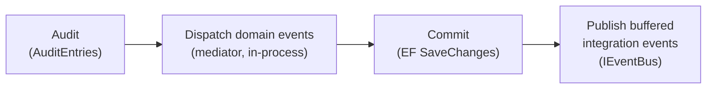

# Architecture

The solution is a modular monolith: reusable framework projects, business modules built on them, one host that composes the modules into a single process, and per-provider migrator apps that create and seed the schema. This document is the entry point to the architecture docs; each project's detail lives in its own overview, linked below.

## Layering

| Layer | Projects | Responsibility |
|---|---|---|
| Framework | [Shared](Shared.md) | Shared kernel: DDD building blocks, `IntegrationEvent`, `ICurrentUser`/`IDateTime`, permission authorization, mediator pipeline behaviours |
| | [Infrastructure](Infrastructure.md) | ASP.NET Core hosting blocks: module registration bases, controller bases and response envelope, endpoint mapping, caching, CORS, health checks |
| | [Persistence](Persistence.md) | EF Core blocks: provider selection, context base, audit and domain-event dispatch helpers, repositories, migration support |
| | [EventBusMassTransitRabbitMQ](EventBusMassTransitRabbitMQ.md) | Integration-event bus over MassTransit/RabbitMQ (no-op when disabled) and consumer bases |
| Module | [Identity](Identity.md) (`Identity.Contracts`, `Identity`, `Identity.Web`) | The one business module: users, roles, sessions, token issuance, login pages. Its `.Contracts` project is the only seam other modules may reference |
| Host | [Host](Host.md) | Composition root and the only deployable: registers the framework and the modules, owns the HTTP pipeline and authentication schemes |
| Migrators | `src/Migrations/{MSSQL,PostgreSQL,Sqlite}` | Console apps holding each module's migrations per provider; they migrate and seed — see [migrations.md](../conventions/migrations.md) |
| Tests | `tests/Framework.Tests`, `tests/Identity.Tests` | Unit tests of the framework projects and of the Identity module — see [coding-conventions.md § Testing Conventions](../conventions/coding-conventions.md#testing-conventions) |

## Dependency Direction

The dependency rules are defined in [CLAUDE.md § 1](../../CLAUDE.md#1-repository-purpose); the project-reference diagram and the checks against those rules (no circular references, no direction violations) are in [dependency-graph.md](dependency-graph.md).

## Runtime Flows

### HTTP request pipeline

The host builds one pipeline for the JSON API and the Identity Razor Pages. In order:

1. HTTPS redirection — outside `Development` only.
2. Trace id — sets `HttpContext.TraceIdentifier` to a GUID v7; it becomes the `RequestId` of every response envelope and error body.
3. Exception handler — the vendor middleware turns an exception into the error envelope described below.
4. Request logging — when `RequestLogging:Enable` is set; it runs inside the exception handler, so a failed request is logged before the handler writes the error envelope.
5. Static files, routing, CORS (`AllowCors`), rate limiter, authentication, authorization, Swagger.
6. Module middleware (`AppModule.Use`), then WebSockets.

Endpoints: `/hc` (health), module endpoints (unversioned `AppModuleEndpoint.Map` at the root; `AppModule.Map` under `api/v{version:apiVersion}`), the Identity Razor Pages, and the MVC controllers, which are secure by default — see [Infrastructure § Design Notes](Infrastructure.md#design-notes).

Responses and errors share one envelope, the vendor `Result`/`Result<T>`:

- **Success and expected failure**: a controller returns through the base `Ok(...)` — see [Infrastructure § Design Notes](Infrastructure.md#design-notes).
- **Invalid input**: model-binding errors are replaced by the vendor invalid-model-state response; FluentValidation failures raised by `ValidationBehaviour` throw the vendor `ValidationException`.
- **Exceptions**: the vendor handler maps a vendor `ExceptionBase` (including `ValidationException`) to its own status code, `KeyNotFoundException` to 404, and anything else to 500 with the message hidden, and writes a `Result` body carrying the `RequestId`.

### Module composition

The host keeps one **assembly scan list** (the host assembly plus each module assembly), defined in its `ConfigureExtensions`. From it the host registers FluentValidation validators, mediator handlers with the `LoggingBehaviour` → `ValidationBehaviour` pipeline, event-bus consumers, and the modules themselves:

- `AddModules<AppModule>` instantiates every `AppModule` in the list and calls its `Add` hooks — this is where a module registers its services and its `DbContext`;
- `UseModules<AppModule>` calls each module's `Use` hook in the pipeline;
- endpoint mapping calls `AppModuleEndpoint.Map` at the root and `AppModule.Map` inside the versioned route group.

A module becomes part of the process by adding its assembly to that list. MVC controllers are discovered by MVC from the assemblies the host references, not from the scan list.

### Persistence save path

Each module owns its `DbContext`, registered through `Persistence`'s `AddConfiguredDbContext` for the configured provider. `Persistence` supplies the save-path steps; the module context wires them in its own `SaveChangesAsync`:

- Domain-event dispatch semantics (timing, ordering, DI scope): [Persistence § Design Notes](Persistence.md#design-notes).
- Integration-event buffering, publish-after-commit, and the no-outbox trade-off: [Identity § Design Notes](Identity.md#design-notes), the implementation of record.
- The schema comes from the migrators — see [migrations.md](../conventions/migrations.md).

### Messaging

Integration events are published through `IEventBus`; the host registers the bus once, with every `AppModuleConsumer` found in the scan list. Enabled vs. no-op behaviour, delivery policy, queues, and consumer registration: [EventBusMassTransitRabbitMQ](EventBusMassTransitRabbitMQ.md). The migrators' settings files have no `RabbitMQ` section, so they run on the no-op bus.

### Authentication and authorization

- **Authentication** is the host's concern: Bearer tokens for `/api`, a hub-only Bearer scheme, and the Identity cookie for the Razor Pages, selected by request path — see [Host § Design Notes](Host.md#design-notes). Tokens are issued by the Identity module — see [Identity](Identity.md); the client-facing sign-in paths are diagrammed in [README § Login Flow](../../README.md#login-flow-client--server).
- **Authorization** is permission-based and comes from `Shared` — see [Shared § Design Notes](Shared.md#design-notes). Modules contribute their permission catalogs by registering a vendor `IPermissionDefinitionProvider`.
- **Current user**: code depends on `ICurrentUser`; the host binds it to the HTTP user (`ServerCurrentUser`), a migrator to a fixed `Migrator` identity.

## Key Design Patterns

- **Result pattern** for expected failures, with one response envelope for successes and errors.
- **Mediator (CQRS-style requests)** with logging and validation pipeline behaviours; domain events are mediator notifications.
- **Domain events dispatched on save** and **integration events published after commit**, as described above.
- **Module registration by assembly scanning** over the vendor modularity package, with separate hooks for services, middleware, and endpoints.
- **Per-module `DbContext`** over one configurable provider, with the module's own default schema.
- **Vendor base types**: most framework types derive from a `Lightsoft.*` (`Light.*`) type that owns the core behaviour; the framework fixes the choices on top.

## Extension Points for Modules

| A module… | Uses | Documented in |
|---|---|---|
| joins the host | an `AppModule` (and optionally an `AppModuleEndpoint`) in an assembly on the host's scan list | [Infrastructure](Infrastructure.md) |
| exposes an API | controllers on `VersionedApiController` / `ApiControllerBase`, returning through `Ok(...)` | [Infrastructure](Infrastructure.md) |
| persists data | its own context via `AddConfiguredDbContext`, optionally on `BaseDbContext`, calling `AuditEntries` and `DispatchDomainEvents` on save; migrations in each migrator project, whose `AddMigrationsServices` call includes the module assembly | [Persistence](Persistence.md), [migrations.md](../conventions/migrations.md) |
| models its domain | `AuditableEntity`, `DomainEvent`, value objects | [Shared](Shared.md) |
| protects endpoints | permission policies plus an `IPermissionDefinitionProvider` for its catalog | [Shared](Shared.md) |
| talks to other modules | its `.Contracts` seam, or integration events through `IEventBus` and the consumer bases | [EventBusMassTransitRabbitMQ](EventBusMassTransitRabbitMQ.md), [Identity](Identity.md) |

## Known Architectural Risks / Debt

| Finding | Severity | Notes |
|---|---|---|
| No transactional outbox for integration events | Medium | Accepted — see [Identity § Design Notes](Identity.md#design-notes) |
| Hard-coded super user | Medium | See [Shared § Design Notes](Shared.md#design-notes) |
| Save path wired per context | Low | `BaseDbContext` does not audit or dispatch; each module context must call the helpers itself — see [Persistence § Design Notes](Persistence.md#design-notes) |

## Notes

<!-- manual: content below this line is human-authored and must be preserved verbatim during sync -->

---
_Last synced: 2026-09-30_
