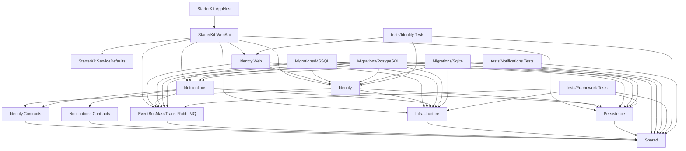

# Dependency Graph

## Project References

Direct `<ProjectReference>` entries of every project in `StarterKit.slnx` (A → B means A references B):

The three migration projects share the same references, except that `Migrations/Sqlite` does not reference `Notifications`. The dependency rules these edges are checked against are in [CLAUDE.md § 1](../../CLAUDE.md#1-repository-purpose).

## Package References

Versions live in `Directory.Packages.props` (central package management), except for the test projects, the migration projects, `StarterKit.ServiceDefaults`, and `StarterKit.AppHost` — see [Version Mismatches](#version-mismatches).

| Project | Packages | Purpose |
|---|---|---|
| `Shared` | `Lightsoft.SharedKernel`, `Lightsoft.Result`, `Lightsoft.Mediator`, `Lightsoft.EventBus`, `Lightsoft.AspNetCore.Authorization`, `Lightsoft.Extensions`, `FluentValidation`, `Mapster` | Vendor kernel, `Result`, mediator, event-bus abstractions, authorization, validation, mapping |
| `Infrastructure` | `Lightsoft.AspNetCore.Extensions`, `Lightsoft.AspNetCore.Modularity`, `Lightsoft.Caching`, `Lightsoft.FileGenerator`, `Lightsoft.Serilog`, `AspNetCore.HealthChecks.UI.Client` | Hosting helpers, module registration, caching, file generation, logging, health checks |
| `Persistence` | `Lightsoft.EntityFrameworkCore`, `Lightsoft.Caching`, EF Core providers (InMemory, Sqlite, SqlServer, Npgsql) | EF Core base and the supported providers |
| `EventBusMassTransitRabbitMQ` | `Lightsoft.EventBus.MassTransit.RabbitMQ` | MassTransit/RabbitMQ transport and consumer bases |
| `Identity.Contracts` | — | — |
| `Identity` | `Microsoft.AspNetCore.Identity.EntityFrameworkCore`, `Microsoft.Extensions.Identity.Core`, `Lightsoft.ActiveDirectory`, `Lightsoft.Caching`, `Lightsoft.SharedKernel` | Identity store, Active Directory, cache |
| `Identity.Web` | `Microsoft.AspNetCore.Authentication.OpenIdConnect`, `FluentValidation.DependencyInjectionExtensions` | Entra ID sign-in, validator registration |
| `Notifications.Contracts` | — | — |
| `Notifications` | `Lightsoft.SmtpMail` | SMTP mail |
| `StarterKit.WebApi` | `Lightsoft.AspNetCore.Extensions`, `Lightsoft.AspNetCore.Swagger`, `Microsoft.AspNetCore.Authentication.JwtBearer`, `FluentValidation.DependencyInjectionExtensions`, `AspNetCore.HealthChecks.UI.Client`, `Spectre.Console`, `Microsoft.VisualStudio.Azure.Containers.Tools.Targets` | Host helpers, Swagger, hub Bearer scheme, validator registration, health-check output, startup banner, container tooling |
| `StarterKit.ServiceDefaults` | `Microsoft.Extensions.Http.Resilience`, `Microsoft.Extensions.ServiceDiscovery`, `OpenTelemetry.Extensions.Hosting`, `OpenTelemetry.Exporter.OpenTelemetryProtocol`, `OpenTelemetry.Instrumentation.AspNetCore`, `OpenTelemetry.Instrumentation.Http`, `OpenTelemetry.Instrumentation.Runtime` | Aspire service defaults: HttpClient resilience, service discovery, telemetry |
| `StarterKit.AppHost` | `Aspire.Hosting.Redis`, `Aspire.Hosting.RabbitMQ` (project SDK `Aspire.AppHost.Sdk`) | Aspire orchestration and dashboard, Redis and RabbitMQ resources |
| `src/Migrations/*` | `Microsoft.EntityFrameworkCore.Design`, `Microsoft.EntityFrameworkCore.Tools`, `Microsoft.Extensions.Configuration(.Abstractions)`, `Microsoft.Extensions.Hosting(.Abstractions)`; plus `Microsoft.EntityFrameworkCore.SqlServer` (MSSQL) and `Microsoft.EntityFrameworkCore`/`Microsoft.EntityFrameworkCore.Relational` (PostgreSQL) | Design-time EF tooling and the console host for migrate-and-seed |
| `tests/*` | `xunit.v3`, `xunit.runner.visualstudio`, `Microsoft.NET.Test.Sdk`, `Moq` (from `tests/ModuleTests.props`) | Test stack |

## Circular References

None found.

## Version Mismatches

The migration projects under `src/Migrations/` opt out of central package management (`ManagePackageVersionsCentrally=false`) and set `Version="$(AspnetVersion)"` on each `PackageReference`, using the same `AspnetVersion` property `Directory.Packages.props` uses for its Microsoft packages.

`StarterKit.ServiceDefaults` opts out as well (`ManagePackageVersionsCentrally=false`) and sets a literal `Version=` on each `PackageReference`, by decision: it stays the Aspire template as shipped. `StarterKit.AppHost` opts out the same way for its Aspire hosting packages, and its Aspire SDK version is pinned on its `Sdk="Aspire.AppHost.Sdk/…"` attribute. None of these packages is in `Directory.Packages.props`, so there is no conflicting second version.

No other `src/` project sets `Version=` on a `PackageReference`. `tests/ModuleTests.props` opts the test projects out of central package management and pins the test-stack versions itself; those packages are not in `Directory.Packages.props`, so there is no conflicting second version.

## Direction Violations

None found:

- `Shared` references no solution project; framework projects reference only `Shared`.
- `Identity.Contracts` and `Notifications.Contracts` reference only `Shared`.
- `Identity` references its own `.Contracts` and framework projects only; `Identity.Web` references its own module (intra-module), `Infrastructure`, and `EventBusMassTransitRabbitMQ` (its standalone host registers the bus).
- `Notifications` references its own `.Contracts`, framework projects, and another module only through its seam (`Identity.Contracts`, for the integration event it consumes and the `IIdentityModuleApi` it calls).
- Nothing references a migration project. Outside each module's own projects and tests, `StarterKit.WebApi` references `Identity`, `Identity.Web`, and `Notifications`, and the migration projects reference `Identity` (all three) and `Notifications` (MSSQL and PostgreSQL) — all composition roots, not modules.
- Only `StarterKit.AppHost` references `StarterKit.WebApi`, and nothing references `StarterKit.AppHost`. `StarterKit.ServiceDefaults` references no solution project, and only `StarterKit.WebApi` references it.

## Notes

<!-- manual: content below this line is human-authored and must be preserved verbatim during sync -->

---
_Last synced: 2026-09-30_
