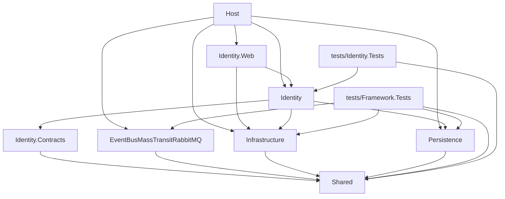

# Dependency Graph

## Project References

Direct `<ProjectReference>` entries of every project in `StarterKit.slnx` (A → B means A references B):

The dependency rules these edges are checked against are in [CLAUDE.md § 1](../../CLAUDE.md#1-repository-purpose).

## Package References

Versions live in `Directory.Packages.props` (central package management), except for the test projects — see [Version Mismatches](#version-mismatches).

| Project | Packages | Purpose |
|---|---|---|
| `Shared` | `Lightsoft.SharedKernel`, `Lightsoft.Result`, `Lightsoft.Mediator`, `Lightsoft.EventBus`, `Lightsoft.AspNetCore.Authorization`, `Lightsoft.Extensions`, `FluentValidation`, `Mapster` | Vendor kernel, `Result`, mediator, event-bus abstractions, authorization, validation, mapping |
| `Infrastructure` | `Lightsoft.AspNetCore.Extensions`, `Lightsoft.AspNetCore.Modularity`, `Lightsoft.Caching`, `Lightsoft.FileGenerator`, `Lightsoft.Serilog`, `AspNetCore.HealthChecks.UI.Client` | Hosting helpers, module registration, caching, file generation, logging, health checks |
| `Persistence` | `Lightsoft.EntityFrameworkCore`, `Lightsoft.Caching`, EF Core providers (InMemory, Sqlite, SqlServer, Npgsql) | EF Core base and the supported providers |
| `EventBusMassTransitRabbitMQ` | `Lightsoft.EventBus.MassTransit.RabbitMQ` | MassTransit/RabbitMQ transport and consumer bases |
| `Identity.Contracts` | — | — |
| `Identity` | `Microsoft.AspNetCore.Identity.EntityFrameworkCore`, `Microsoft.Extensions.Identity.Core`, `Lightsoft.ActiveDirectory`, `Lightsoft.Caching`, `Lightsoft.SharedKernel` | Identity store, Active Directory, cache |
| `Identity.Web` | `Microsoft.AspNetCore.Authentication.OpenIdConnect`, `FluentValidation.DependencyInjectionExtensions` | Entra ID sign-in, validator registration |
| `Host` | `Lightsoft.AspNetCore.Extensions`, `Lightsoft.AspNetCore.Swagger`, `Microsoft.AspNetCore.Authentication.JwtBearer`, `FluentValidation.DependencyInjectionExtensions`, `AspNetCore.HealthChecks.UI.Client`, `Spectre.Console`, `Microsoft.VisualStudio.Azure.Containers.Tools.Targets` | Host helpers, Swagger, hub Bearer scheme, validator registration, health-check output, startup banner, container tooling |
| `tests/*` | `xunit.v3`, `xunit.runner.visualstudio`, `Microsoft.NET.Test.Sdk`, `Moq` (from `tests/ModuleTests.props`) | Test stack |

## Circular References

None found.

## Version Mismatches

None found in `src/`: no project sets `Version=` on a `PackageReference`. `tests/ModuleTests.props` opts the test projects out of central package management (`ManagePackageVersionsCentrally=false`) and pins the test-stack versions itself; those packages are not in `Directory.Packages.props`, so there is no conflicting second version.

## Direction Violations

None found:

- `Shared` references no solution project; framework projects reference only `Shared`.
- `Identity.Contracts` references only `Shared`.
- `Identity` references its own `.Contracts` and framework projects only; `Identity.Web` references its own module (intra-module) and `Infrastructure`.
- Nothing references `Host`; outside the Identity module and its tests, only `Host` references `Identity` and `Identity.Web`.

## Notes

<!-- manual: content below this line is human-authored and must be preserved verbatim during sync -->

---
_Last synced: 2026-09-30_
